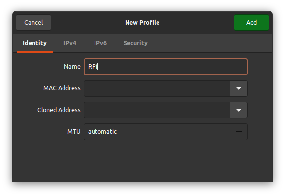
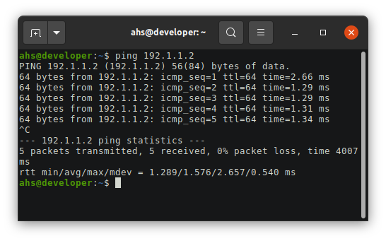
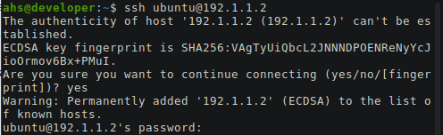
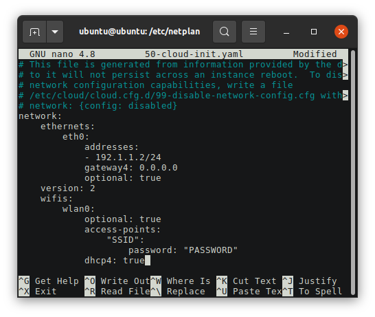

### Instructions to setup a headless Raspberry Pi 3B+ with Ubuntu 20.04.2 Focal and ROS Noetic

The laptop computer I'm using to setup the bootable Raspberry Pi micro SD card is running Ubuntu 20.04.1

Start by downloading the server image:
[Ubuntu Server 20.04.2 LTS](https://ubuntu.com/download/raspberry-pi)

I'm using the server image since this Raspberry Pi will be used headless with no keyboard, mouse, or monitor attached.

Once the image download is complete, insert your micro SD card. On Ubuntu, right click the image and select "Open With Disk Image Writer"

If you don't have that option you may need to install the gnome disks tool
`sudo apt install gnome-disk-utility`

I'm using a 16GB micro SD card. Make sure you select the correct drive from the "Destination" dropdown menu!

Then click Start Restoring...

Once that completes you will have a new partition named system-boot mounted. Do not eject it, we will modify the network-config file to assign a static IP address. I like to start with a static IP address over ethernet and later setup wifi if needed to install additional software.

Open a terminal and navigate to /media/ahs/system-boot where "ahs" is my user name.

Edit the file named network-config. Under the line eth0: 
delete dhcp4: true
Add the IP address and subnet you want to use. I'm going to use the address 192.1.1.2/24 the /24 signifies a subnet of 255.255.255.0 for the default gateway I'll use 0.0.0.0 since I won't be using a gateway. Your file should look like this when complete:


Now save and close the file. Eject your micro SD card and insert into your Raspberry Pi. Connect the Pi to you computer using an ethernet cable and power on the Pi.

You'll next have to setup networking on your computer. I used the GUI network manager to configure my computer to have a static IP address of 192.1.1.3

See this page on setting up a static IP address using the network manager GUI on Ubuntu desktop. [Static IP setup](/tutorials/static-ip-setup/static-ip-setup.md)

Open a new terminal window and check if you have a connection using ping:


Now we will connect over SSH. The default user and password should both be "ubuntu".
`ssh ubuntu@192.1.1.2`

You will see a prompt like this asking to add the RPi to your known hosts:


Enter the default password "ubuntu" and you'll be forced to select a new password. After selecting a new password it will log you off. Now ssh in again, this time using your new password.

Now that we have a local network setup between our laptop computer and the Raspberry Pi, we'll want to connect it to wifi so that we can begin downloading necessary packages.

---------------------------------------------------
#### found an issue with this section will resolve soon

In your terminal connected to the Pi, navigate to /etc/cloud/cloud.cfg.d/ and edit the file named 50-cloud-init.yaml. I use the nano editor 
`sudo nano 50-cloud-init.yaml`

It is very important to use proper spacing for indents or else the file won't work.

You'll want to edit the file to look like this:


To exit nano, hit ctrl^x y enter

In your terminal, execute the following:
`sudo netplan apply`

-----------------------------------------------------

After a few seconds check that your wifi is working with
`ip a`

You should see both your ethernet connection eth0 and wifi connection wlan0. Both will have an IP address assigned to them if everything is setup properly. You may have to reboot your Pi before you gain full internet access over wifi.
`sudo reboot`

To manage bringing your network up or down you can use these commands:
```
ip link set wlan0 down
ip link set wlan0 up
```

I like to disconnect my robots from wifi/internet when not needed.

Set correct timezone, yours will probably be different
`sudo timedatectl set-timezone Pacific/Honolulu`

Next, we'll want to make sure everything is up to date:
```
sudo apt update
sudo apt upgrade
```

You will likely have to reboot again
`sudo reboot`

Now we are ready to install docker and ROS.

[Instructions to install docker](https://docs.docker.com/engine/install/ubuntu/)

In a terminal connected to the Pi, enter the following:
```
sudo apt-get update
sudo apt-get install apt-transport-https
sudo apt-get install ca-certificates
sudo apt-get install curl
sudo apt-get install gnupg
sudo apt-get install lsb-release
```

```
curl -fsSL https://download.docker.com/linux/ubuntu/gpg | sudo gpg --dearmor -o /usr/share/keyrings/docker-archive-keyring.gpg
```

```
echo \
>   "deb [arch=arm64 signed-by=/usr/share/keyrings/docker-archive-keyring.gpg] https://download.docker.com/linux/ubuntu \
>   $(lsb_release -cs) stable" | sudo tee /etc/apt/sources.list.d/docker.list > /dev/null
```

The Raspberry Pi has an arm64 architecture so make sure you select the right link on the docker download page. 

```
sudo apt-get update
sudo apt-get install docker-ce docker-ce-cli containerd.io
```

Once that is all complete you'll want to test your docker install.
`sudo docker run hello-world`

Follow the post install instructions from docker so that you can run container operations without the need for sudo.

You are now ready to run ros docker containers. Here is a quick test you can run to have a publisher and subscriber in two different containers...