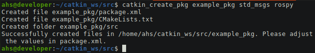

### Brief instructions on how to create a new ros package and set it up for version control using git.

First step is to create your own github account if you don't have one.

On your github page, create a new repository. Name the repository the same as you want your package to be named. ROS package naming convention is to use lowercase letters and underscores, no spaces or hyphens and don't start the name of the package with a number. Add a readme and license file if you want.

On your computer, navigate to your catkin workspace. Create your package using `catkin_create_package`



Now change directory into your package folder and enter the following. You'll have to use the URL for your own newly created repository.
```
git init
git remote add origin https://github.com/ahs808/serial_python_driver.git
git pull origin main
```

My local branch was automatically named master when I created it. You'll have to setup tracking to be able to push/pull from your repo.
`git branch --set-upstream-to=origin/main master`

There was one issue I encountered when trying to push code. My local branch name "master" didn't match with the remote branch named "main". One way to fix this is to rename my local branch to "main" to match the upstream branch, if you need to use a different name there are ways to modify your push.default setting but this was easier for me.
`git branch -m main`

Now you are ready to push/pull from your local package directory to your github. Other users can clone your package by going directly to their ~/catkin_ws/src/ directory and entering:
`git clone https://github.com/ahs808/serial_python_driver.git`

Don't forget to run a `catkin_make` when you finish your package.

For a python ROS package I like to create a /nodes directory to store my code in.