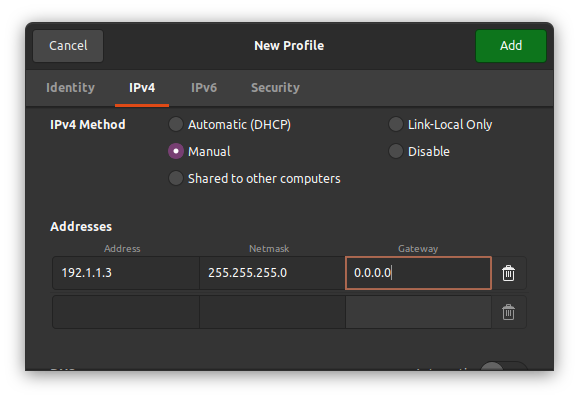

### How to set static IP addresses on ubuntu computers

###### This first method uses the network manager GUI supplied with the Ubuntu desktop version

In the top right corner of your screen click the drop down menu and then navigate to "Wired Settings" this will take you to a networking menu. 

Click the + button to the right of the "Wired" subsection title to add a new network profile. 

Click on the Identity tab and give the connection a name, I used RPi. Then in the MAC Address dropdown select your MAC, there should only be one option. 

Next go to the IPv4 tab. Select Manual for the IPv4 Method. Under Addresses you will have to enter the Address, Netmask, and Gateway as I have below:

Scroll down further and uncheck "Automatic" for DNS and Routes then click the Apply button in the top right. Now select your new network to connect to it.

The IP address can be anything of your choosing within the max allowable values (255). Although, I recommend you research how an IP address is structured. The netmask differentiates the network ID and host ID. For an address of 192.1.1.3 with a netmask of 255.255.255.0, the host ID is 192.1.1 and the host ID is 3. The gateway is an address where traffic is sent when the destination is outside the network. This should usually be sent to a router. For very simple networks where all devices have static IP addresses it is sufficient to set the gateway to 0.0.0.0 which is interpreted as unspecified.